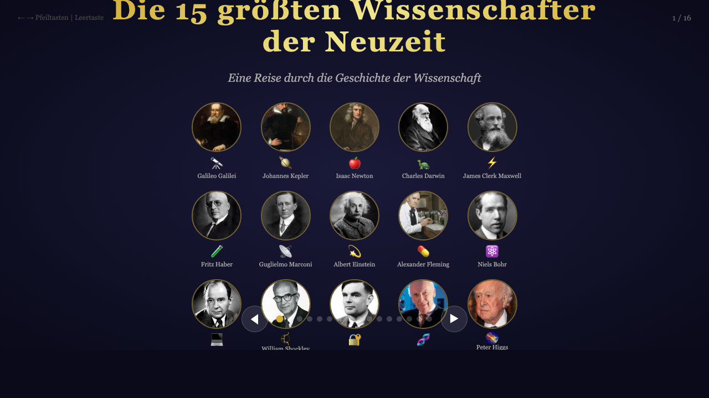

# Die 17 größten Wissenschafter der Neuzeit

An interactive slideshow presenting 17 of the greatest scientists of the modern era, featuring portraits, biographies, key achievements, and historical influence. Fully responsive — works on desktop and mobile.

## Languages

- 🇩🇪 German — `index.html`
- 🇬🇧 English — `index_en.html`
- 🇮🇹 Italian — `index_it.html`

## Featured Scientists

Galileo Galilei · Johannes Kepler · Isaac Newton · Charles Darwin · James Clerk Maxwell · Fritz Haber · Guglielmo Marconi · Albert Einstein · Alexander Fleming · Niels Bohr · John von Neumann · William Shockley · Alan Turing · Watson & Crick · James Watt · Carl Friedrich Gauss · Peter Higgs · Robert F. Furchgott

## Usage

Open any of the HTML files in a browser. No installation or build step required.

### Navigation

- **Arrow keys** / **Spacebar** — next/previous slide
- **Home** / **End** — first/last slide
- Click the navigation dots or prev/next buttons
- **Mobile**: Swipe left/right to navigate

## Screenshot

The slideshow opens with a title slide showing a grid of all scientists, then presents each one individually with a portrait, biography, achievements, and a quote about their influence.